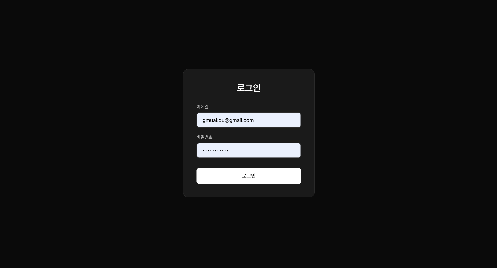
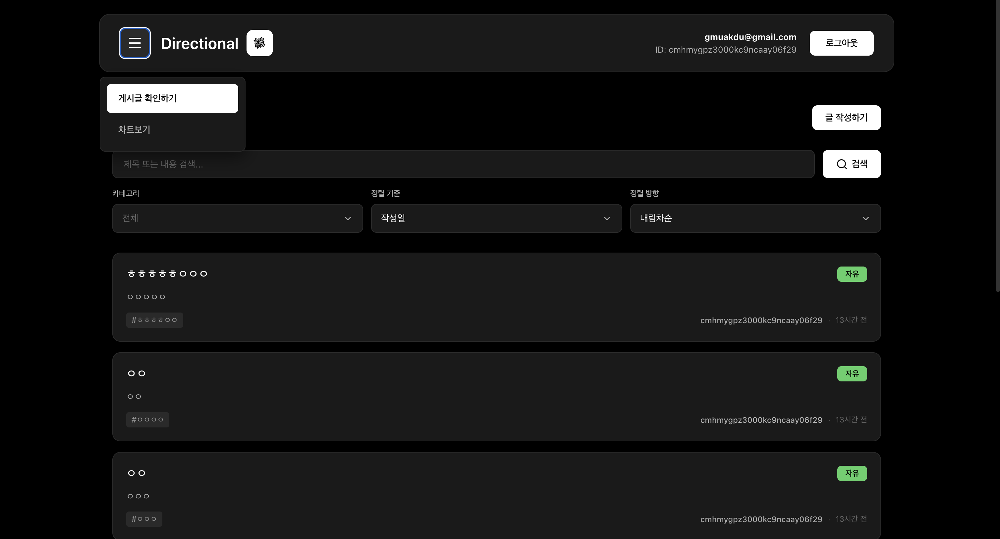
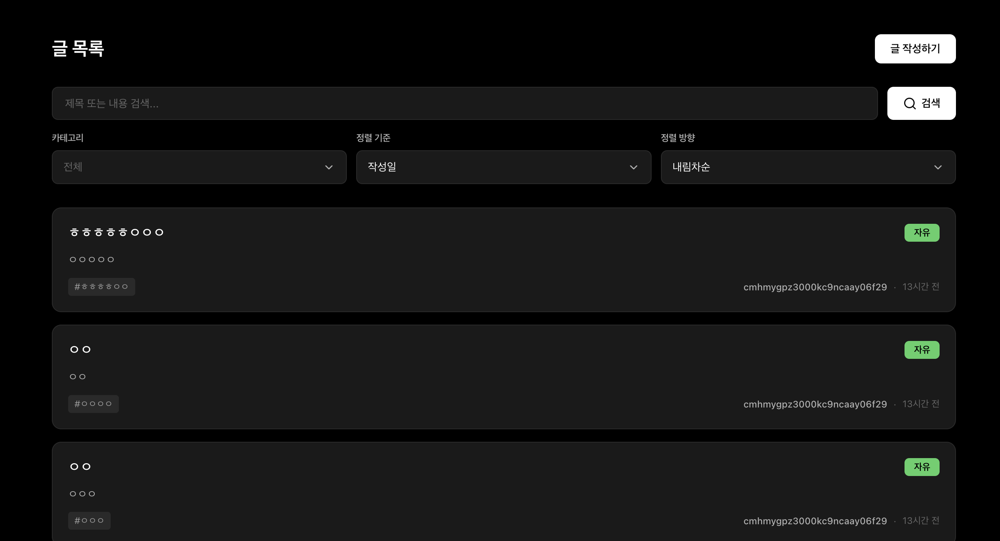
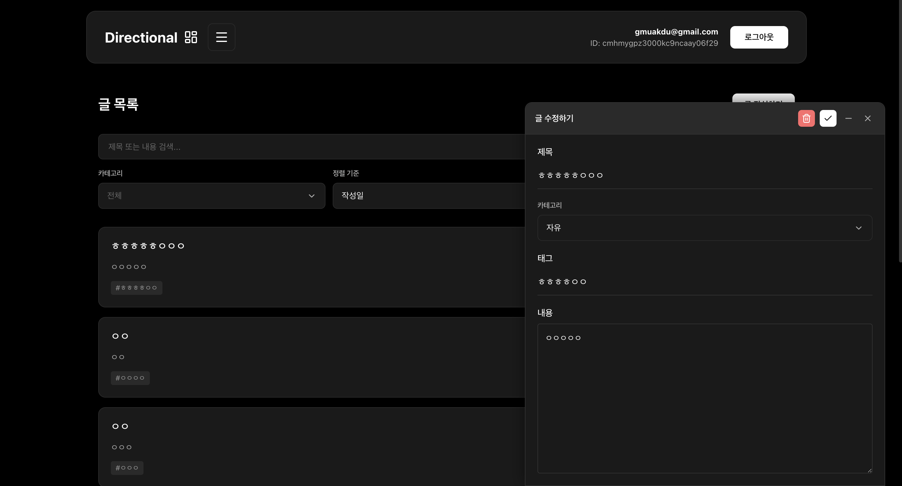
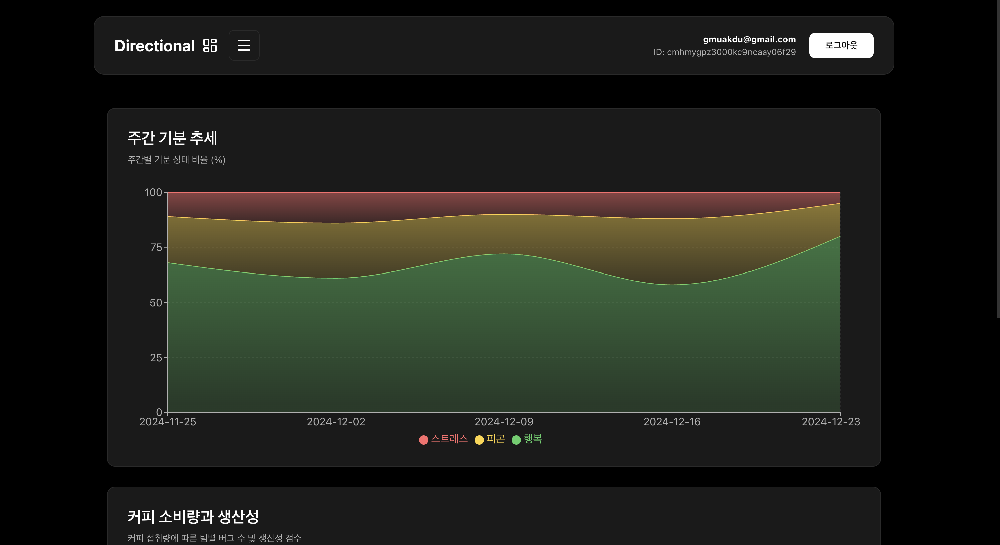

# Directional Frontend

React와 TypeScript를 사용한 게시판 및 차트 대시보드 애플리케이션

## 📸 스크린샷

### 로그인 화면



- 이메일/비밀번호 로그인
- 실시간 이메일 유효성 검사
- 다크 테마 UI

### 헤더 메뉴



- 게시판/차트 탭 전환
- 반응형 네비게이션
- 로그아웃 기능

### 게시판



- 무한 스크롤 게시글 목록
- 검색, 정렬, 필터 기능
- 카테고리별 게시글 분류
- 스크롤 기반 게시글 가시성 애니메이션

### 게시글 수정



- 플로팅 창 형태의 작성/수정 UI
- Google Mail 스타일의 최소화 가능한 창
- 실시간 수정 및 삭제 기능
- 금칙어 필터링

### 차트 대시보드



- 주간 기분 추세 (스택형 면적 차트)
- 커피 소비량과 생산성 (멀티라인 차트)
- 반응형 차트 디자인

## 기술 스택

### 핵심 라이브러리

- **React** `19.1.1` - UI 라이브러리
- **TypeScript** `5.9.3` - 타입 안정성
- **Vite** `7.1.7` - 빌드 도구 및 개발 서버

### 상태 관리 및 라우팅

- **React Router DOM** `6.x` - 클라이언트 사이드 라우팅
- **Context API** - 전역 상태 관리 (인증, Toast)

### 스타일링

- **Styled-components** `6.1.19` - CSS-in-JS 스타일링
- **반응형 디자인** - 모바일/태블릿/데스크톱 지원

### 데이터 시각화

- **Recharts** `2.x` - 차트 라이브러리
  - 스택형 면적 차트 (Area Chart)
  - 멀티라인 차트 (Line Chart)
  - 이중 Y축 지원

### HTTP 통신

- **Axios** `1.13.2` - HTTP 클라이언트
  - Interceptor를 통한 인증 토큰 관리
  - Mock 데이터 지원

### UI/UX

- **Lucide React** `0.552.0` - 아이콘 라이브러리
- **커스텀 Toast** - 성공/에러/확인 알림 시스템
- **커스텀 Dropdown** - 재사용 가능한 드롭다운 컴포넌트

## 주요 기능

### 인증 시스템

- 이메일/비밀번호 로그인
- JWT 토큰 기반 인증
- 이메일 유효성 검사
- 자동 로그아웃 (401 에러 처리)

### 게시판 기능

- 게시글 CRUD (생성, 조회, 수정, 삭제)
- 무한 스크롤 (커서 기반 페이지네이션)
- 검색 (제목/본문)
- 정렬 (작성일/제목)
- 카테고리 필터 (자유/공지/질문)
- 금칙어 필터링
- 스크롤 기반 게시글 가시성 애니메이션

### 차트 대시보드

- **주간 기분 추세** (스택형 면적 차트)
  - X축: 주차
  - Y축: 백분율
  - 누적 형태 표시
- **커피 소비량과 생산성** (멀티라인 차트)
  - X축: 커피 섭취량
  - 왼쪽 Y축: 버그 수
  - 오른쪽 Y축: 생산성 점수
  - 팀별 라인 (Frontend, Backend, AI)
  - 실선/점선 구분

### UI 컴포넌트

- **플로팅 작성 창** - Google Mail 스타일
- **전역 Toast** - 성공/에러/확인 메시지
- **커스텀 Dropdown** - 통일된 드롭다운 UI
- **반응형 Header** - 탭 기반 네비게이션
- **글로벌 스크롤바** - 커스텀 스타일링

## 커스텀 훅

- `useAuth` - 인증 상태 관리
- `useToast` - Toast 알림 관리
- `useEmailValidation` - 이메일 유효성 검사
- `useForbiddenWords` - 금칙어 체크
- `usePostForm` - 게시글 폼 상태 및 로직 관리

## 프로젝트 구조

```
src/
├── api/              # API 호출 함수
│   ├── auth.ts
│   ├── posts.ts
│   └── chart.ts
├── components/       # 재사용 가능한 컴포넌트
│   ├── Board.tsx
│   ├── Chart.tsx
│   ├── WeeklyMoodChart.tsx
│   ├── CoffeeConsumptionChart.tsx
│   ├── Dropdown.tsx
│   ├── Header.tsx
│   ├── Toast.tsx
│   └── WritePost.tsx
├── contexts/         # Context API
│   ├── AuthContext.tsx
│   └── ToastContext.tsx
├── hooks/           # 커스텀 훅
│   ├── useEmailValidation.ts
│   ├── useForbiddenWords.ts
│   └── usePostForm.ts
├── lib/             # 유틸리티
│   └── api.ts       # Axios 인스턴스
├── pages/           # 페이지 레벨 컴포넌트
│   ├── Dashboard.tsx
│   └── Login.tsx
├── styles/          # Styled-components
│   ├── GlobalStyle.ts
│   ├── Board.ts
│   ├── Chart.ts
│   ├── Dropdown.ts
│   ├── Header.ts
│   ├── Login.ts
│   ├── Toast.ts
│   └── WritePost.ts
└── types/           # TypeScript 타입 정의
    ├── auth.ts
    ├── post.ts
    └── chart.ts
```

## 주요 디자인 특징

- **다크 테마** - 눈의 피로를 줄이는 검은 배경
- **반응형 디자인** - 모든 디바이스에서 최적화
- **부드러운 애니메이션** - 페이드인, 슬라이드, 호버 효과
- **일관된 색상 팔레트** - 브랜드 아이덴티티 유지
- **접근성** - 명확한 시각적 피드백

## 실행 방법

```bash
# 의존성 설치
npm install

# 개발 서버 실행
npm run dev

# 프로덕션 빌드
npm run build

# 프리뷰
npm run preview
```

## 라우팅

- `/` - 기본 페이지 (게시판으로 리다이렉트)
- `/writings` - 게시판
- `/chart` - 차트 대시보드

## 주요 API 엔드포인트

- `POST /auth/login` - 로그인
- `POST /posts` - 게시글 작성
- `GET /posts` - 게시글 목록 조회
- `GET /posts/:id` - 게시글 단건 조회
- `PUT /posts/:id` - 게시글 수정
- `DELETE /posts/:id` - 게시글 삭제
- `GET /mock/weekly-mood-trend` - 주간 기분 추세 (Mock)
- `GET /mock/coffee-consumption` - 커피 소비 데이터 (Mock)

## 보안 기능

- JWT 토큰 기반 인증
- HTTP-only 로컬 스토리지
- Axios Interceptor를 통한 자동 토큰 첨부
- 401 에러 시 자동 로그아웃
- 금칙어 필터링

## 개발 중점 사항

- **관심사의 분리** - 컴포넌트/페이지/훅 분리
- **재사용성** - 커스텀 훅 및 공통 컴포넌트
- **타입 안정성** - TypeScript 엄격 모드
- **사용자 경험** - 로딩/에러 상태 처리
- **코드 품질** - ESLint, 일관된 코드 스타일
